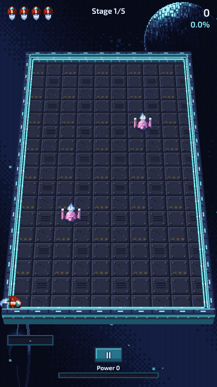
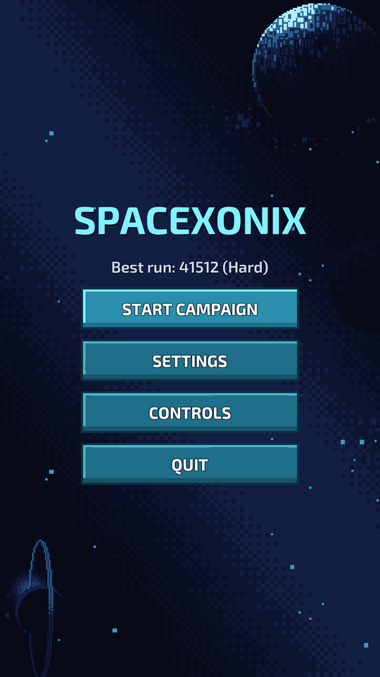
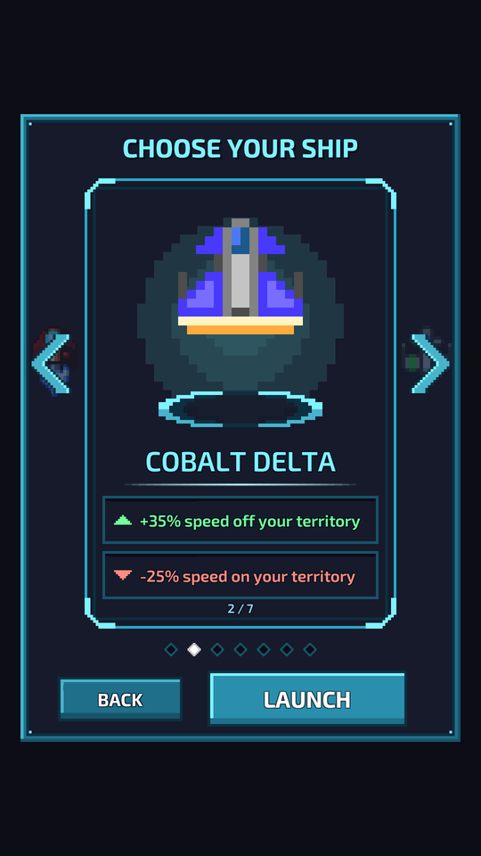
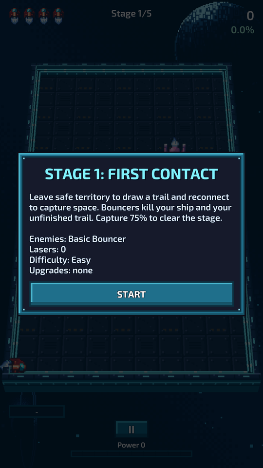
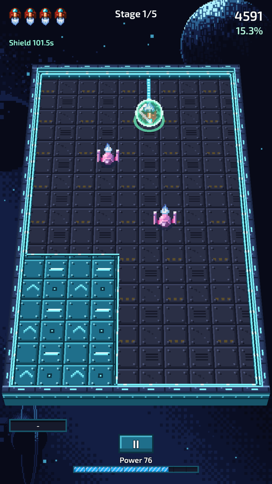
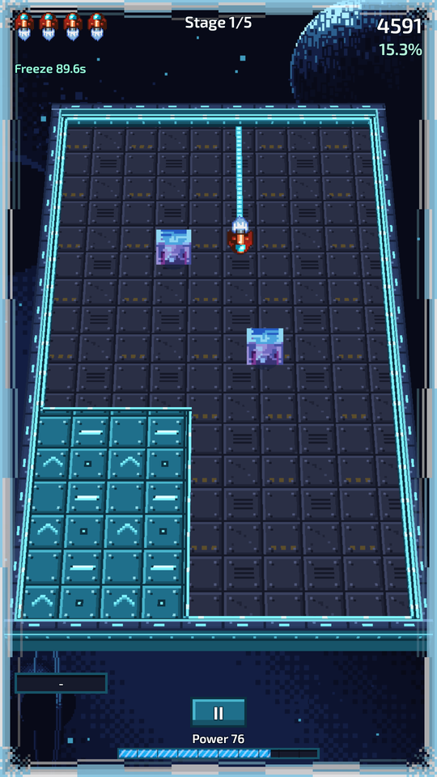
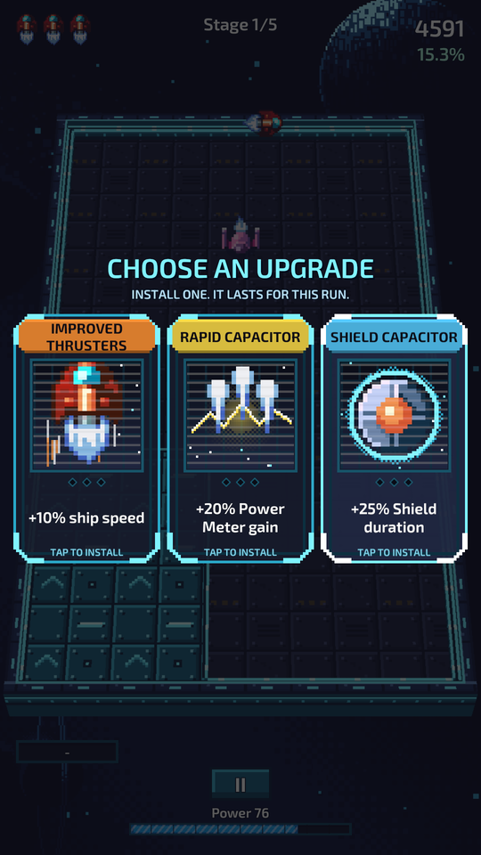
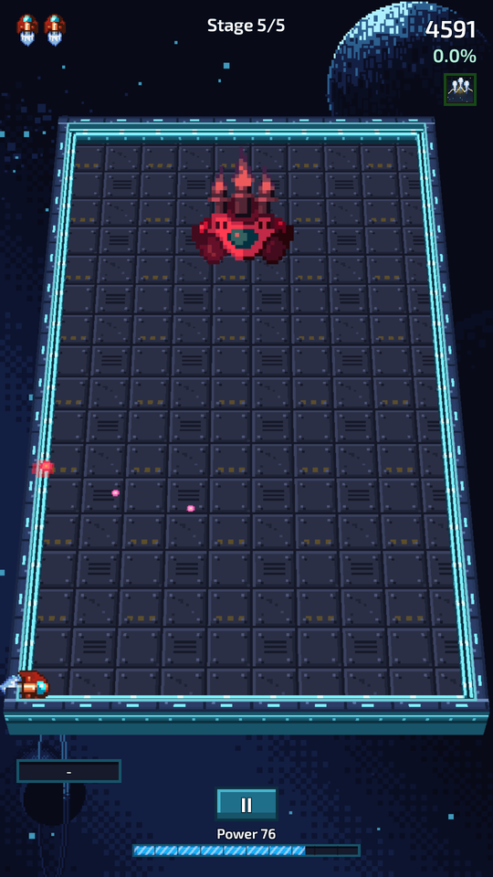
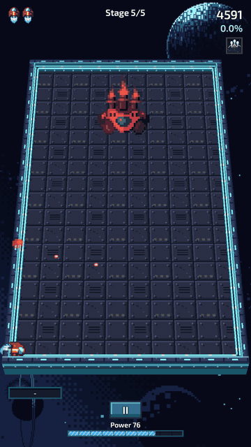

# SpaceXonix

**A portrait arcade game about claiming space.** Fly out of safe territory, draw a trail through open space, and close it to capture the area, while aliens, lasers and a final boss try to cut you off.

Inspired by the classic *AirXonix*. Made in Unity for **Android** and **Windows**.

[**⬇ Download the latest release**](https://github.com/idanyossi/SpaceXonix/releases/latest)

## How to play

- Your ship is safe on captured territory (the raised teal floor) and on the arena's edge.
- Leave it and you draw a **trail** behind you. Get back to safe territory and everything you enclosed is **captured**, as long as no alien is inside it.
- While the trail is open you're exposed: if an alien touches you **or your trail**, you lose a life.
- **Capture 75% of the arena** to clear the stage. Bigger captures score more, charge your Power Meter faster, and are more likely to drop a power-up.

| Action | Phone | PC |
|---|---|---|
| Steer | Swipe | WASD or arrow keys |
| Power Shot | POWER button | Space |
| Use stored ability | ABILITY button | E |
| Pause | Pause button | Esc |

## Screenshots

<table>
  <tr>
    <td align="center"> Main menu</td>
    <td align="center"> Pick a ship: each trades a strength for a weakness</td>
    <td align="center"> Every stage opens with a briefing</td>
  </tr>
  <tr>
    <td align="center"> Shield: covers the ship and the trail around it</td>
    <td align="center"> Freeze: every alien stops in its tracks</td>
    <td align="center"> Choose an upgrade after each stage</td>
  </tr>
  <tr>
    <td align="center"> Stage 5: the Alien Core</td>
    <td align="center" colspan="2"> Capture enough of its arena and the core goes down</td>
  </tr>
</table>

## Features

- **Five-stage campaign**, from *First Contact* to the *Alien Core*, on **Easy** or **Hard**.
- **Four kinds of alien:**
  - **Bouncers** ricochet around.
  - **Linear aliens** patrol straight lines.
  - **Unstable aliens** change speed, with a warning first.
  - **Volatile aliens** explode into other aliens, turning them into charged hybrids that blow holes in your territory.
- **Laser hazards** that warn, then fire across the arena near you.
- **Power Shot:** fill the Power Meter by capturing, then fire a plasma bolt that destroys the first alien in its path, or stuns the boss.
- **Three abilities** to pick up and store:
  - **Shield** protects the ship and the trail around it.
  - **Freeze** stops every alien.
  - **Arena Tilt** slides the aliens to one side.
- **Seven upgrades** to build a run from, such as extra lives, speed, faster power and longer abilities.
- **Random stage modifiers** that change each stage and raise your score multiplier.
- **Seven ships**, each with its own mix of strengths and weaknesses.
- **Pixel art in 2.5D:** raised territory, a tilted camera and hovering sprites.
- **Runs smoothly:** a steady 60 fps on a mid-range Android phone.

## Download and install

Get both files from the [**latest release**](https://github.com/idanyossi/SpaceXonix/releases/latest).

**Android** (7.1 or newer, 64-bit)
1. Download `SpaceXonix-1.0.0-Android.apk` on your phone and open it.
2. Allow installs from your browser or file manager if Android asks.
3. If Google Play Protect warns about an unknown app, choose **Install anyway**. The game isn't on the Play Store, so Google hasn't scanned it.

**Windows** (10/11, 64-bit)
1. Download `SpaceXonix-1.0.0-Windows.zip` and extract it.
2. Run `SpaceXonix.exe`.
3. If SmartScreen appears, click **More info**, then **Run anyway**. The exe isn't code-signed.

## For developers

**Built with:** Unity **6000.3.20f1** (Unity 6.3 LTS), URP, the Input System and Cinemachine.

**Open and run:**
1. Clone the repo and open the folder in Unity Hub with Unity 6000.3.20f1.
2. Press Play. The editor always starts from the Boot scene, the way the game does.

**Build:** use **File > Build Profiles**. Android is set up with IL2CPP, ARM64, portrait only and the `com.idanyossi.spacexonix` package.

**Tests:** 386 EditMode tests and 8 Play Mode tests, one of which plays a full five-stage campaign. Run them from **Window > General > Test Runner**.

**Where things live:**

| Path | What |
|---|---|
| `Assets/SpaceXonix/Scripts/Board` | The board model: trail, capture flood fill, territory. The rules everything else follows. |
| `Assets/SpaceXonix/Scripts/Core` | Game state, lives, and the single path for losing a life |
| `Assets/SpaceXonix/Scripts/Enemies`, `Hazards`, `Boss` | Aliens, lasers, the Alien Core |
| `Assets/SpaceXonix/Scripts/Campaign` | Stages, upgrades, modifiers |
| `Assets/SpaceXonix/Scripts/Presentation`, `UI` | Everything you see: effects, camera, HUD, menus |
| `Assets/SpaceXonix/Editor` | Menu tools under **SpaceXonix >** that generate art and wire up scenes |
| `SpaceXonixProposal.md` | The game design document |
| `PROG.md` | Development log, phase by phase |

## Credits

- **Art:** Luis Zuno ([@ansimuz](https://ansimuz.com)) and Master484, both CC0.
- **Sound and music:** Juhani Junkala, CC0.
- **Font:** Exo 2 by Natanael Gama, under the SIL Open Font License.

The full list, with sources and licences, is in [`Assets/ThirdParty/ATTRIBUTION.md`](Assets/ThirdParty/ATTRIBUTION.md).
