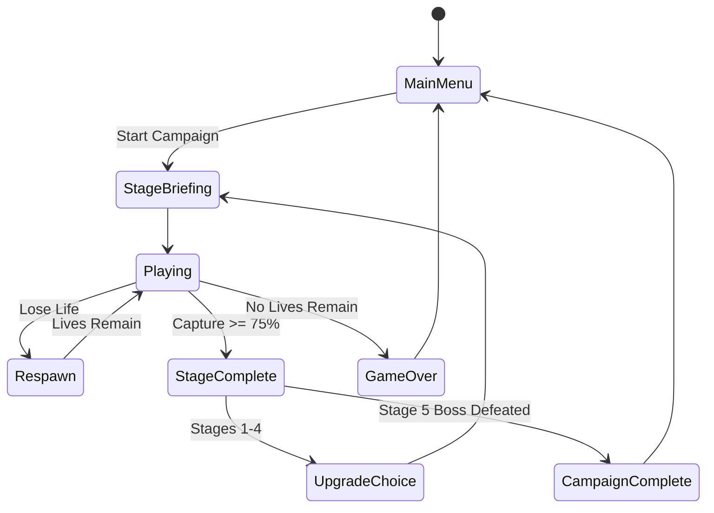
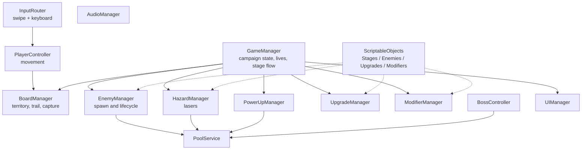

# Game Design Document — *SpaceXonix*

| | |
|---|---|
| **Working title** | SpaceXonix |
| **Team** | Ori Cohen — Developer; Idan Yossifov — Developer |
| **Genre** | Arcade / territory capture / light roguelite |
| **Target platform** | Android + Windows PC |
| **Engine / Unity version** | Unity 6.3 LTS, 6000.3.20f1 |
| **Rendering** | URP, 3D scene with pixel-art sprites and orthographic tilted camera |
| **Orientation & reference resolution** | Portrait, 1080 × 1920 |
| **Expected session length** | 8–15 minute campaign run |
| **Document version** | v0.3 — 2026-09-12 |

---

# 1. High Concept

**SpaceXonix** is a portrait 2.5D arcade game inspired by AirXonix. The player pilots a spaceship around a dangerous arena, leaves safe territory to draw vulnerable trails, and captures space by reconnecting to claimed territory. Capture 75% to clear each stage while avoiding aliens and laser hazards. Between stages, random upgrades and modifiers change each campaign run.

## Design Pillars

1. **Risk creates reward**  
   Larger captures expose the player for longer, but grant more score, faster Power Meter charging, and a better chance of receiving a power-up.

2. **Simple controls, meaningful decisions**  
   The player only chooses movement direction and when to use an ability or Power Shot. Difficulty comes from route planning, enemy behaviour and timing rather than complicated controls.

3. **Readable arcade action with strong feedback**  
   Every hazard must be understandable before it kills the player. Large captures, enemy destruction, explosions, power-ups and boss attacks should feel visually and audibly satisfying.

---

# 2. Reference & Inspiration

## Primary Reference: AirXonix

SpaceXonix keeps the central territory-capture structure:

- movement around safe territory;
- leaving safe territory creates a vulnerable trail;
- reconnecting that trail captures an enclosed region;
- enemies can kill the player or hit the unfinished trail;
- the stage ends after enough territory has been captured;
- the player has a limited number of lives.

SpaceXonix differs through:

- portrait mobile-first controls;
- tilted 2.5D presentation;
- retro-futuristic pixel-art visuals;
- four enemy behaviours;
- laser hazards;
- temporary abilities;
- a Power Meter and offensive shot;
- stage modifiers;
- roguelite-style upgrades between stages;
- a dedicated boss stage.

A labelled AirXonix screenshot and short gameplay-video reference will be included in the repository before submission.

---

# 3. Core Game Loop

## Moment-to-Moment Rules

- The player controls a spaceship moving in the four cardinal directions.
- The ship moves continuously once a direction has been selected.
- Safe captured territory can be traversed freely.
- Leaving safe territory starts an exposed trail.
- The exposed trail follows the player's path until the ship reconnects to safe territory.
- If an alien touches the ship while exposed, the player loses one life.
- If an alien touches the unfinished trail, the player loses one life.
- Losing a life removes the unfinished trail.
- Already captured territory normally remains after losing a life.
- The ship respawns on a safe section of the board.
- The player starts each stage with **3 lives**.
- Reconnecting a valid trail captures the enclosed region according to classic AirXonix behaviour.
- A region containing an active alien cannot be captured.
- If both regions are valid, the smaller valid region is captured.
- Normal stages end when captured territory reaches **75%**.
- Losing all lives ends the entire Campaign run and returns the player to the Main Menu.

## Scoring

Score is earned primarily through captured territory.

Initial scoring formula:

`100 points × percentage captured`

A single large capture grants a multiplier:

| Area captured in one move | Multiplier |
|---|---:|
| Under 5% | ×1.0 |
| 5–9.99% | ×1.5 |
| 10–14.99% | ×2.0 |
| 15%+ | ×3.0 |

Stage modifiers may add an additional score bonus.

This encourages the player to attempt larger, more dangerous captures instead of repeatedly trimming tiny safe sections.

## Power Meter

Capturing territory also charges a Power Meter.

Initial value:

`5 Power × percentage captured`

At **100 Power**, the player receives one Power Shot.

The shot:

- travels horizontally or vertically;
- follows the spaceship's current facing direction;
- destroys the first standard alien it hits;
- consumes the full Power Meter;
- uses a pooled projectile;
- does not directly damage the final boss.

A successful Power Shot against the boss briefly interrupts its attack cycle.

## Power-Up Spawning

Successful captures of at least 5% may spawn one pickup.

Initial spawn chance:

`15% + 2% per percentage point captured`

Maximum chance:

**60%**

Larger captures therefore increase:

- score;
- Power Meter gain;
- power-up spawn probability.

## Tunable Parameters

| Parameter | Purpose | Initial value |
|---|---|---:|
| `playerMoveSpeed` | Normal movement speed | 5 |
| `captureTarget` | Stage completion percentage | 75% |
| `startingLives` | Lives per stage | 3 |
| `powerPerCapturedPercent` | Power Meter gain | 5 |
| `shieldDuration` | Shield duration | 4 s |
| `freezeDuration` | Freeze duration | 3 s |
| `tiltDuration` | Arena Tilt duration | 5 s |
| `tiltPlayerSlow` | Player slowdown during Tilt | 20% |
| `laserWarningDuration` | Warning before laser fires | 0.75 s |
| `respawnDelay` | Delay after losing a life | 1.25 s |
| `pickupBaseChance` | Base pickup spawn chance | 15% |
| `pickupMaxChance` | Maximum pickup chance | 60% |
| `volatileBlastRadius` | Explosion radius | Inspector tuned |
| `volatileTerritoryDamage` | Territory removed by explosion | Inspector tuned |

Gameplay values will live in ScriptableObjects or serialized Inspector fields so they can be tuned without recompiling.

## Feel Target

A new player should understand the core capture mechanic within five attempts.

Once the mechanic is understood, skilled players should deliberately seek larger captures because they provide noticeably greater rewards.

---

# 4. Controls & Input

| Action | Windows PC | Android |
|---|---|---|
| Change direction | WASD / Arrow Keys | Swipe |
| Use stored ability | `E` | Ability button |
| Fire Power Shot | `Space` | Power button |
| Pause | `Esc` | Pause button |
| Menu navigation | Mouse / keyboard | Touch |

## Mobile Input Rules

- Swiping changes direction rather than controlling the ship's exact position.
- Swipe direction is determined by the dominant X or Y movement.
- Very small swipes are ignored.
- UI touches are not interpreted as gameplay swipes.
- Gameplay input is disabled during respawn and transitions.
- PC and Android controls feed the same input abstraction.

---

# 5. Screens & UI

## Main Menu

Elements:

- SpaceXonix title/logo
- Start Campaign
- Settings
- Controls
- Quit on PC

## Stage Briefing

Shown before each stage.

Displays:

- stage number;
- enemy types present;
- active stage modifier;
- modifier description;
- modifier score bonus;
- current run upgrades;
- Start button.

## Gameplay HUD

Displays:

- capture percentage;
- score;
- lives;
- Power Meter;
- one stored ability slot;
- active ability duration where relevant;
- pause button.

The HUD deliberately avoids unnecessary text during play.

## Upgrade Selection

After completing Stages 1–4:

**Choose one of three randomly selected upgrades.**

Each option shows:

- name;
- icon;
- exact gameplay effect.

## Pause Menu

- Resume
- Restart Campaign
- Settings
- Main Menu

## Stage Complete

Displays:

- total score;
- percentage captured;
- largest single capture;
- modifier bonus;
- Continue.

## Game Over

Displays:

- final Campaign score;
- highest stage reached;
- Retry Campaign;
- Main Menu.

## Settings

- Master Volume
- Music Volume
- SFX Volume
- Vibration On/Off
- Camera Shake On/Off

## Controls

Shows separate illustrated control layouts for PC and Android.

## Canvas Setup

- Canvas Scaler: **Scale With Screen Size**
- Reference Resolution: **1080 × 1920**
- Match: **0.5**
- UI anchored relative to screen edges
- safe-area support for mobile devices

---

# 6. Power-Ups

SpaceXonix contains **three core temporary abilities**.

The player may store only **one power-up at a time**.

A new pickup replaces the currently stored ability only after player confirmation or according to the final selected UX behaviour.

## Shield

Temporarily protects the spaceship.

Initial duration:

**4 seconds**

During Shield:

- enemy contact does not remove a life;
- laser contact does not remove a life;
- the player still needs to complete trails normally;
- the shield is visually obvious.

Feedback:

- energy shield surrounding the ship;
- activation sound;
- remaining duration shown on the ability icon.

## Freeze

Freezes all standard aliens for a short period.

Initial duration:

**3 seconds**

During Freeze:

- Basic Bouncers stop;
- Linear Aliens stop;
- Unstable Aliens stop;
- Volatile Aliens stop;
- their movement resumes when Freeze ends;
- environmental laser systems continue operating.

Freeze therefore creates a safer capture window without completely removing stage danger.

The final boss is immune to Freeze.

Visual feedback:

- frozen enemies receive a clear blue/ice effect;
- activation produces a screen-wide pulse;
- a distinct audio cue plays when Freeze begins and ends.

Freeze is implemented using a coroutine and shared enemy state rather than manually modifying every enemy independently.

## Arena Tilt

A signature SpaceXonix ability.

For several seconds:

- the arena visually tilts;
- the camera rolls slightly;
- directional force is applied to active aliens;
- aliens drift toward one side of the arena;
- the player remains controllable;
- player movement speed is reduced by approximately 20%.

Arena Tilt creates new capture opportunities while also making ship movement less forgiving.

The boss stage does not spawn Arena Tilt pickups because no standard aliens are present.

---

# 7. Roguelite Upgrades

Campaign upgrades last only for the current run.

After Stages 1–4, the player chooses **one of three random upgrades**.

Possible upgrades:

## Reinforced Hull

Gain +1 life at the beginning of following stages.

## Improved Thrusters

Increase base movement speed by 10%.

## Rapid Capacitor

Increase Power Meter gain by 20%.

## Shield Capacitor

Increase Shield duration.

## Cryogenic Core

Increase Freeze duration.

## Gravity Stabilizer

Reduce the player movement penalty during Arena Tilt.

## Scavenger Protocol

Increase pickup spawn chance.

Upgrades have maximum stack levels where appropriate.

All upgrades disappear when the Campaign ends.

There is no permanent character progression.

---

# 8. Enemies & Hazards

## Basic Bouncer

The standard enemy.

Behaviour:

- moves continuously through uncaptured territory;
- bounces from arena boundaries;
- can collide with the player;
- can touch the unfinished trail.

Purpose:

establish the fundamental territory-capture threat.

## Linear Alien

Moves strictly:

- horizontally, or
- vertically.

It reverses direction when blocked.

Its predictable pattern creates different route-planning problems from the Basic Bouncer.

## Unstable Alien

Moves similarly to a standard alien but periodically changes speed.

Speed remains inside a configured safe range.

Speed changes are visibly telegraphed so deaths remain understandable instead of feeling random.

## Volatile Alien

A dangerous alien that can also be manipulated by the player.

The Volatile Alien moves through uncaptured territory like a standard enemy.

When it collides with another standard alien, it explodes.

The explosion:

- destroys the Volatile Alien;
- turns nearby standard aliens into hybrids (see below) instead of destroying them;
- kills the player if the ship is inside the blast radius;
- removes part of already captured territory inside the blast radius;
- does not automatically end the stage.

Destroyed captured cells return to uncaptured territory and therefore reduce the player's current captured percentage.

The Volatile Alien creates a deliberate risk/reward interaction:

- keeping it alive is dangerous;
- guiding enemies toward it can remove several threats;
- allowing it to explode near valuable territory may erase progress.

Explosion range is clearly telegraphed before or during detonation through VFX.

Volatile Aliens are immune to their own initial collision trigger for a short spawn period to prevent immediate accidental explosions.

### Hybrid Aliens (changed after playtesting, 2026-09-25)

Destroying caught aliens made Volatile Aliens clear the board for the player. Instead, an alien caught in a Volatile blast becomes a hybrid:

- it keeps its own type and movement (a hybrid Bouncer still bounces, a hybrid Unstable still changes speed);
- it pulses in the Volatile's orange so the player can tell it is charged;
- its charge goes off when it touches territory the player captured, never the permanent border: it blows a hole of the Volatile's territory radius centred on the territory it touched, hits the ship if it is inside the blast, and uses the hybrid up;
- it gets the same short protection a new Volatile does, so the blast that made it cannot set it off;
- hybrids never explode on other aliens, and Volatile Aliens never detonate on or convert hybrids, so explosions cannot chain;
- every alien turned into a hybrid brings one new regular alien (Bouncer, Linear or Unstable, at random) onto a free cell away from the ship, so a Volatile never thins the stage out;
- a Volatile Alien that runs into a hybrid is absorbed into it and doubles its charge (up to four times), doubling the size of its eventual blast; the more charged a hybrid is, the faster and harder it blinks.

## Laser Hazard

Laser emitters are positioned around arena boundaries.

They fire only:

- horizontally, or
- vertically.

Never diagonally.

Attack sequence:

1. emitter activates;
2. warning line appears;
3. warning sound plays;
4. beam fires;
5. cooldown begins.

Lasers:

- damage only the player;
- do not kill aliens;
- do not remove captured territory;
- do not intentionally trigger Volatile Alien explosions.

Laser warning and beam effects use object pooling.

---

# 9. Campaign Structure

Campaign contains **five stages**.

## Stage 1 — First Contact

Introduces:

- basic movement;
- territory capture;
- Basic Bouncer.

Purpose:

teach the fundamental rules without requiring a long tutorial.

## Stage 2 — Crossfire

Introduces:

- Linear Alien;
- simple laser hazards.

## Stage 3 — Unstable Sector

Introduces:

- Unstable Alien;
- mixed Basic and Linear enemy combinations;
- more demanding laser timing.

## Stage 4 — Volatile Zone

Introduces:

- Volatile Alien;
- explosions;
- territory destruction caused by Volatile Aliens;
- combinations of all previous normal enemies and hazards.

This acts as the final mechanical test before the boss.

## Stage 5 — Alien Core

Boss stage.

No standard enemies are present.

The boss is stationary.

The boss repeatedly fires pooled projectiles.

Boss projectiles:

- remove one life when hitting the player;
- remove one life when hitting the unfinished trail.

Boss projectiles **do not destroy captured territory in the guaranteed version**.

The boss cannot be defeated through normal shooting.

The player defeats the boss by capturing **75% of the arena**.

Each successful capture visually damages the Alien Core.

At 75%:

- boss attacks stop;
- boss destruction sequence begins;
- the arena fills;
- Campaign Complete is shown.

A Power Shot temporarily interrupts the boss's attack cycle but does not directly reduce its health.

Shield functions normally against boss projectiles.

Freeze and Arena Tilt do not affect the boss.

---

# 10. Stage Modifiers

Every Campaign stage receives one compatible random modifier.

The modifier is shown before the stage begins.

## Overclocked Swarm

Alien movement speed increased by approximately 20%.

Score bonus: ×1.15

## Laser Storm

Laser cooldown reduced.

Score bonus: ×1.15

## Dense Sector

One additional compatible standard alien is spawned.

Score bonus: ×1.15

## Resource Shortage

Power-up spawn probability is reduced.

Score bonus: ×1.10

## Unstable Space

Unstable Aliens change speed more frequently.

Score bonus: ×1.15

## Volatile Matter

Volatile Alien explosion radius is increased.

Score bonus: ×1.20

Only stages containing Volatile Aliens may receive this modifier.

Boss-compatible modifiers may adjust:

- boss projectile speed;
- firing interval;
- attack frequency.

Modifiers are stored as ScriptableObjects rather than hardcoded stage variants.

---

# 11. Art & Audio

## Visual Direction

SpaceXonix uses a **retro-futuristic pixel-art style presented in a 2.5D world**.

The arena is a 3D surface viewed through an orthographic tilted camera.

The spaceship and enemies use pixel-art sprites placed inside the 3D world.

Captured territory clearly contrasts with uncaptured space.

## Major Visual Effects

Guaranteed polish features:

- animated territory fill;
- capture pulse;
- large-capture effect;
- player-hit animation;
- standard enemy destruction;
- Volatile Alien explosion;
- territory destruction animation;
- Shield effect;
- Freeze effect;
- Arena Tilt presentation;
- Power Shot effect;
- laser charging;
- laser firing;
- camera shake;
- boss destruction sequence.

## Capture Feedback

Capturing a large section should be one of the game's strongest presentation moments.

A successful major capture may include:

- bright border flash;
- animated fill sweeping across the claimed region;
- multiplier display;
- Power Meter surge;
- short camera shake;
- layered capture sound;
- particle burst.

## Audio

Required sound categories:

- movement/direction feedback;
- trail creation;
- successful capture;
- large capture;
- Power Meter full;
- Power Shot;
- pickup spawn;
- Shield;
- Freeze activation;
- Freeze release;
- Arena Tilt;
- standard alien destruction;
- Volatile explosion;
- player hit;
- laser warning;
- laser firing;
- boss projectile;
- boss destruction;
- UI interaction.

Music:

- menu loop;
- normal gameplay loop;
- boss music.

## Asset Licensing

Third-party assets will only be used when their licence permits use in the project.

Possible sources:

- Kenney
- itch.io
- OpenGameArt
- Freesound

Exact asset sources and licences will be documented in the repository.

---

# 12. Technical Design

## Scenes

### `Boot.unity`

Initializes persistent global services.

### `MainMenu.unity`

Contains:

- Main Menu;
- Settings;
- Controls.

### `Game.unity`

Runs Campaign Stages 1–4 using data-driven stage configurations.

### `Boss.unity`

Contains the final Alien Core encounter.

Using one scene for Stages 1–4 avoids duplicated level logic.

## Architecture

## Main Scripts

| Script | Responsibility |
|---|---|
| `GameManager` | Campaign state, stage progression and lives |
| `BoardManager` | Territory state, exposed trails, region capture and territory removal |
| `PlayerController` | Ship movement |
| `InputRouter` | Converts PC/mobile input into shared commands |
| `EnemyManager` | Enemy spawning and active-enemy tracking |
| `EnemyController` | Shared enemy state such as Freeze and pooling lifecycle |
| `BouncerEnemy` | Standard bouncing movement |
| `LinearEnemy` | Horizontal/vertical movement |
| `UnstableEnemy` | Random speed-change behaviour |
| `VolatileEnemy` | Collision-triggered explosion behaviour |
| `LaserManager` | Laser warning and firing |
| `PowerMeter` | Charge and Power Shot |
| `PowerUpManager` | Pickup spawning and stored temporary ability |
| `UpgradeManager` | Run upgrade selection and application |
| `StageModifierManager` | Random stage modifier selection |
| `BossController` | Final-stage attack logic |
| `PoolService` | Reusable projectiles, enemies, pickups and VFX |
| `UIManager` | HUD and menu state |
| `AudioManager` | Music and sound effects |

Gameplay systems communicate primarily through references and C# events rather than repeated scene searches.

---

# 13. Course Features

## Object Pooling

Used for:

- standard aliens;
- Volatile Aliens;
- Power Shot projectiles;
- boss projectiles;
- power-up pickups;
- laser effects;
- explosion effects;
- repeated particle effects.

Frequently reused runtime objects are recycled rather than continually instantiated and destroyed.

## Coroutines

Used for:

- Shield duration;
- Freeze duration;
- Arena Tilt duration;
- player respawn;
- laser warning/firing;
- boss attack timing;
- Volatile Alien detonation timing where required;
- UI transitions.

## Singleton

`GameManager` acts as the single global source for:

- Campaign state;
- current stage;
- current lives;
- scene transitions.

`AudioManager` may also persist globally.

Singletons are not used for systems that do not require global uniqueness.

## ScriptableObjects

Used for:

- enemy configurations;
- stage configurations;
- upgrade definitions;
- modifier definitions;
- power-up configurations;
- balance values.

This allows gameplay variations without duplicating logic.

## PlayerPrefs

Used for:

- Campaign high score;
- master volume;
- music volume;
- SFX volume;
- vibration preference;
- camera-shake preference.

No large save system is required.

## Mobile Controls & Build

The project includes:

- Android build;
- swipe movement;
- touch buttons;
- safe-area support;
- responsive Canvas scaling.

PC uses the same gameplay systems through keyboard input.

## Cinemachine

Used for:

- main tilted gameplay camera;
- capture camera shake;
- Volatile Alien explosion feedback;
- Arena Tilt presentation;
- boss presentation.

## Audio & Animation

Used throughout:

- sprite animations;
- capture animation;
- ability presentation;
- enemy destruction;
- UI transitions;
- gameplay SFX;
- boss sequence.

## Profiling

Before submission, the game will be checked with:

- Unity CPU Profiler;
- GC Alloc measurements;
- Memory Profiler;
- Frame Debugger where relevant;
- Android device performance testing.

Target:

**stable 60 FPS on the Android test device.**

---

# 14. Scope

## 14.1 MVP — Required

The project is not considered complete without:

- [ ] Four-direction movement
- [ ] Territory capture
- [ ] Vulnerable trail
- [ ] Enemy/trail collision
- [ ] 75% stage-completion target
- [ ] Three-life system
- [ ] Campaign reset after Game Over
- [ ] Score system
- [ ] Large-capture multiplier
- [ ] Power Meter
- [ ] Power Shot
- [ ] Basic Bouncer
- [ ] Linear Alien
- [ ] Unstable Alien
- [ ] Volatile Alien
- [ ] Volatile Alien explosions
- [ ] Volatile explosion territory destruction
- [ ] Laser hazard
- [ ] Shield
- [ ] Freeze
- [ ] Arena Tilt
- [ ] Stage modifiers
- [ ] Roguelite upgrade selection
- [ ] Five-stage Campaign
- [ ] Stage 5 boss
- [ ] Main Menu
- [ ] Gameplay HUD
- [ ] Pause menu
- [ ] Upgrade screen
- [ ] Stage Complete screen
- [ ] Game Over screen
- [ ] Settings screen
- [ ] Controls screen
- [ ] Android swipe input
- [ ] PC keyboard input
- [ ] Android build
- [ ] Windows build
- [ ] Object pooling
- [ ] Coroutines
- [ ] GameManager singleton
- [ ] ScriptableObjects
- [ ] PlayerPrefs
- [ ] Audio
- [ ] Animated territory capture

## 14.2 Polish

After the MVP is stable:

- [ ] stronger capture VFX;
- [ ] larger-capture presentation;
- [ ] camera shake tuning;
- [ ] improved Freeze presentation;
- [ ] improved Arena Tilt presentation;
- [ ] Volatile Alien warning animation;
- [ ] territory destruction animation;
- [ ] polished enemy death effects;
- [ ] boss destruction sequence;
- [ ] menu transitions;
- [ ] additional music;
- [ ] additional stage modifiers.

## 14.3 Stretch Goals

These features are **not required for the submitted MVP**.

- [ ] Endless Mode
- [ ] Endless high score / stage record
- [ ] Speed Boost power-up
- [ ] Additional upgrade types
- [ ] Additional modifier types
- [ ] Boss projectiles destroying captured territory
- [ ] Controller support

## 14.4 Explicitly Out of Scope

- Multiplayer
- Online leaderboards
- Accounts
- Cloud saves
- Level editor
- Narrative campaign
- Cutscenes
- Permanent RPG progression
- Inventory system
- Equipment system
- Procedural arena geometry
- Multiple bosses
- More than four guaranteed standard enemy types
- Monetization
- Ads
- Online services
